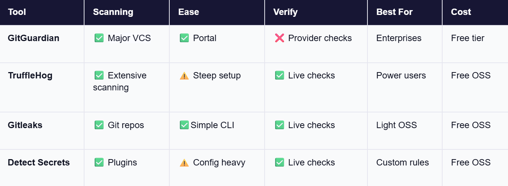

  <h2 align="center">Project Tea</h2>
	

		
	

  
No tea will be spilled today

## Tổng quan dự án
**Secrets là gì?**
Secrets là những dữ liệu nhạy cảm mà nếu bị lộ sẽ gây ra hậu quả nghiêm trọng đến vấn đề bảo mật của ứng dụng và hệ thống. Những loại secrets thường gặp bao gồm mã định danh (authentication tokens), mật khẩu (passwords), khóa API (API keys), mật mã mã hóa (encryption keys), và nhiều dữ liệu khác có khả năng cung cấp quyền điều khiển đối với tài nguyên.

Việc bị người khác truy cập vào hệ thống bằng các mã token bị lộ có thể dẫn đến việc bị đánh cắp những dữ liệu quan trọng, nguy hiểm đến tính toàn vẹn của hệ thống.

**Công cụ phát hiện secrets là gì?**
Hiểu đơn giản gì nó là công cụ chuyên dụng để xác định và ngăn chặn các sự cố lộ thông tin nhạy cảm mà có thể dẫn tới việc cung cấp quyền truy cập trái phép vào các nguồn tài nguyên như database, các dịch vụ bên ngoài hoặc những tài nguyên quan trọng khác.

Những công cụ này vô cùng quan trọng trong việc đảm bảo thông tin nhạy cảm không bị vô tình được công bố lên các hệ thống kiểm xóa mã nguồn nơi mà kẻ xấu có thể truy cập được. Hậu quả không chỉ dừng lại ở mức rò rỉ dữ liệu mà có thể gây ra hậu quả lớn về tài chính, uy tín đối với khách hàng và tổn hại nghiêm trọng đến chính sách bảo mật của công ty.

**Use Cases of Secret Scanning Tools**
Lập trình viên sử dụng công cụ phát hiện secret này trong nhiều ngữ cảnh khác nhau nhưng phần lớn đều với mục đích củng cố bảo mật cho hệ thống trong quá trình phát triển ứng dụng.

Trong môi trường phát triển chung của tổ chức, một cá nhân có thể vô tình lưu thông tin xác thực database dùng để truy cập vào máy chủ  thống vào mã nguồn của họ. Nếu như mã nguồn này được công bố lên các nền tảng quản lý mã nguồn công khai thì việc lộ thông tin này có thể dẫn đến nhiều sự cố đáng tiếc cho hệ thống nếu như không được khắc phục đúng cách.

Và trên thị trường đã có những công cụ nổi tiếng như TruffleHog hoặc Gitleaks có thể thiết lập để phát hiện lỗi bảo mật trước khi mã nguồn được lưu vào các ứng dụng version control.

Các công cụ như TruffleHog và Gitleaks đã làm rất tốt việc phát hiện lỗ hổng bảo mật, và chúng tôi nhận thức rất rõ về khả năng của chúng. Nên thay vì tạo ra một giải pháp mới để cố thay thế sản phẩm đã có sẵn và ổn định. Vậy nên dự án này chúng tôi không tạo ra nhằm cạnh tranh mà hợp tác để có được trải nghiệm tốt hơn. Phần lớn các ứng dụng đã tồn tại tập trung vào giai đoạn sau của quá trình phát triển ứng dụng: : Git hooks, CI pipelines, hay những nền tảng tập trung như GitGuardian. Đợi đến lúc đó thì những secrets này đã nằm chễnh chệ trong bộ nhớ và nhìn vào mắt bạn qua màn hình IDE.

Đó là lý do chúng tôi tạo ra dự án này: **diệt cỏ tận gốc, bắt secrets ngay từ mã nguồn trong lúc bạn đang lập trình.**

## Khảo sát thị trường

Legend: ✅ = good • ⚠️ = partial • ❌ = none

Chúng tôi muốn tạo ra sản phẩm mà các nhà phát triển có thể tin tưởng ngay từ đầu. Đó là lý do tại sao chúng tôi xây dựng tiện ích mở rộng này dựa trên Gitleaks, công cụ mã nguồn mở dùng để phát hiện bí mật trong kho lưu trữ Git. Bằng cách đưa khả năng phát hiện mạnh mẽ của Gitleaks vào IDE, ứng dụng giúp cho các nhà phát triển xác định sự cố sớm hơn trong quy trình, giúp việc khắc phục nhanh hơn và dễ dàng hơn.

Với việc hỗ trợ các mẫu phổ biến như khóa truy cập AWS, mã API, thông tin xác thực cơ sở dữ liệu. Tiện ích sẽ cung cấp cho bạn phản hồi theo thời gian thực khi bạn viết mã, mà không làm gián đoạn quy trình làm việc của bạn.

## Những tính năng mà hệ thống cung cấp
Tiện ích mở rộng này không nhằm mục đích thay thế các công cụ quản lý bảo mật hoặc quét dữ liệu lớn. Nó không phải là một công cụ đa năng mà chỉ giải quyết cho một vấn đề rất cụ thể.

Dự án cung cấp:
* Quét mã nguồn để phát hiện thông tin nhạy cảm như password, API key, token bên trong git repos, files.
* Phân tích toàn bộ lịch sử git commit để phát hiện các thông tin nhạy cảm đã bị lộ.
* Cảnh báo về các thư viện độc hại hoặc có nguy cơ lỗ hỏng bảo mật
* Giao diện thân thiện tích hợp trong VS Code để hiển thị kết quả scan và cảnh báo.

---

#### Sử dụng Gitleaks để quét secret
Cách mà Gitleaks hoạt động: [Gần như chỉ cần Regex](https://lookingatcomputer.substack.com/p/regex-is-almost-all-you-need)

#### Sử dụng database của Aikido để phát hiện thư viện độc hại
Các vấn đề thường gặp phải bởi các nhóm phát triển: "Làm sao để ta có thể lấy được nguồn dữ liệu đáng tin cậy, cập nhât liên tục về các lỗ hổng bảo mật và mã độc trong các thư viện mã nguồn mở mà ta đang sử dụng?"

Aikido đã đứng ra giải quyết vấn đề này bằng cách cung cấp một cơ sở dữ liệu mã độc được cập nhật liên tục từ nhiều nguồn khác nhau: [data](https://malware-list.aikido.dev/malware_predictions.json)

Cách mà họ xây dựng bộ dữ liệu này:

Thu thập dữ liệu thô từ những nguồn công khai như changelogs, diffs, advisories, release notes, registries… và chạy chúng qua một pipeline LLM để:
 ↳ Chuẩn hóa các định dạng không đồng nhất
 ↳ Trích xuất package, version, CVE, severity, exploitability
 ↳ Phân loại theo hệ sinh thái và loại lỗ hổng (XSS, prototype pollution, etc.)
 
Rồi từ đó một kĩ sư an ninh sẽ xem xét từng phát hiện và gán một Intel ID + mức độ nghiêm trọng.

Kết quả là một hệ thống cung cấp dữ liệu gần như liên tục với các cập nhật về lỗ hổng bảo mật và mã độc trong các thư viện mã nguồn mở.

Ưu điểm của Aikido:
✅ Mã nguồn mở
✅ Không tốn chi phí
✅ API-first
✅ Ưu tiên sự đóng góp từ cộng đồng

#### Các kiểu kết quả báo cáo

## Kết hoạch phát triển
| Sprint | Deadline       | Mục tiêu chính                                    | Kết quả cần đạt được                               |
|--------|----------------|--------------------------------------------------|---------------------------------------------------|
| 1      | 26/09/2025     | Nghiên cứu, Định nghĩa dự án (What, Why)         | Báo cáo xác định rõ sản phẩm, mục tiêu, lý do, tài liệu sơ bộ pattern và nguy cơ supply chain |
| 2      | 10/10/2025     | Thiết kế kiến trúc và hệ thống (How, System Design) | Tài liệu thiết kế kiến trúc chi tiết, Use Case, sơ đồ luồng dữ liệu |
| 3      | 24/10/2025     | Phát triển MVP Core Engine                        | MVP quét secret cơ bản với gitleak, quét lịch sử commit git đơn giản, tài liệu kỹ thuật MVP |
| 4      | 07/11/2025     | Phát triển UI VS Code Extension                   | UI cơ bản hiển thị kết quả, cảnh báo cơ bản supply chain, feedback sơ bộ |
| 5      | 21/11/2025     | Hoàn thiện MVP, Báo cáo & Thuyết trình            | MVP hoàn chỉnh, tài liệu tổng hợp, bài thuyết trình và demo dự án |

---
