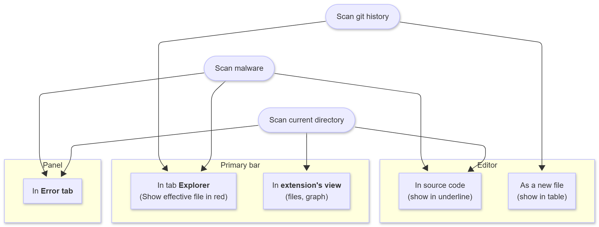

  <h2 align="center">Project Tea</h2>
	

		
	

  
No tea will be spilled today

  

## Tổng quan dự án
Dự án phát triển một tiện ích mở rộng cho VSCode cung cấp:
- Quét mã nguồn để phát hiện thông tin nhạy cảm như password, API key, token bên trong git repos, files.
- Phân tích toàn bộ lịch sử git commit để phát hiện các thông tin nhạy cảm đã bị lộ.
- Cảnh báo về các thư viện độc hại hoặc có nguy cơ lỗ hỏng bảo mật
- Giao diện thân thiện tích hợp trong VS Code để hiển thị kết quả scan và cảnh báo.

#### Lý do phát triển
Chắc chắn trên thị trường đã có nhiều công cụ hỗ trợ tương tự được phổ biến và phát triển từ rất lâu vậy nên chúng tôi không muốn "Reinvent the wheel" mà muốn tận dụng dụng những công nghệ đã có sẵn để nâng cao hơn trải nghiệm của lập trình viên lên một bước mới với việc tích hợp trực tiếp vào IDE, không cần phải setup phức tạp, không cần phải chạy lệnh thủ công, không cần phải chuyển đổi qua lại giữa các công cụ khác nhau. Một trải nghiệm mượt mà và liền mạch.

#### Sử dụng Gitleaks để quét secret
Cách mà Gitleaks hoạt động: [Gần như chỉ cần Regex](https://lookingatcomputer.substack.com/p/regex-is-almost-all-you-need)

#### Sử dụng database của Aikido để phát hiện thư viện độc hại
Các vấn đề thường gặp phải bởi các nhóm phát triển: "Làm sao để ta có thể lấy được nguồn dữ liệu đáng tin cậy, cập nhât liên tục về các lỗ hổng bảo mật và mã độc trong các thư viện mã nguồn mở mà ta đang sử dụng?"

Aikido đã đứng ra giải quyết vấn đề này bằng cách cung cấp một cơ sở dữ liệu mã độc được cập nhật liên tục từ nhiều nguồn khác nhau: [data](https://malware-list.aikido.dev/malware_predictions.json)

Cách mà họ xây dựng bộ dữ liệu này:

Thu thập dữ liệu thô từ những nguồn công khai như changelogs, diffs, advisories, release notes, registries… và chạy chúng qua một pipeline LLM để:
 ↳ Chuẩn hóa các định dạng không đồng nhất
 ↳ Trích xuất package, version, CVE, severity, exploitability
 ↳ Phân loại theo hệ sinh thái và loại lỗ hổng (XSS, prototype pollution, etc.)
 
Rồi từ đó một kĩ sư an ninh sẽ xem xét từng phát hiện và gán một Intel ID + mức độ nghiêm trọng.

Kết quả là một hệ thống cung cấp dữ liệu gần như liên tục với các cập nhật về lỗ hổng bảo mật và mã độc trong các thư viện mã nguồn mở.

Ưu điểm của Aikido:
✅ Mã nguồn mở
✅ Không tốn chi phí
✅ API-first
✅ Ưu tiên sự đóng góp từ cộng đồng

#### Các kiểu kết quả báo cáo

## Kết hoạch phát triển
| Sprint | Deadline       | Mục tiêu chính                                    | Kết quả cần đạt được                               |
|--------|----------------|--------------------------------------------------|---------------------------------------------------|
| 1      | 26/09/2025     | Nghiên cứu, Định nghĩa dự án (What, Why)         | Báo cáo xác định rõ sản phẩm, mục tiêu, lý do, tài liệu sơ bộ pattern và nguy cơ supply chain |
| 2      | 10/10/2025     | Thiết kế kiến trúc và hệ thống (How, System Design) | Tài liệu thiết kế kiến trúc chi tiết, Use Case, sơ đồ luồng dữ liệu |
| 3      | 24/10/2025     | Phát triển MVP Core Engine                        | MVP quét secret cơ bản với gitleak, quét lịch sử commit git đơn giản, tài liệu kỹ thuật MVP |
| 4      | 07/11/2025     | Phát triển UI VS Code Extension                   | UI cơ bản hiển thị kết quả, cảnh báo cơ bản supply chain, feedback sơ bộ |
| 5      | 21/11/2025     | Hoàn thiện MVP, Báo cáo & Thuyết trình            | MVP hoàn chỉnh, tài liệu tổng hợp, bài thuyết trình và demo dự án |

---
