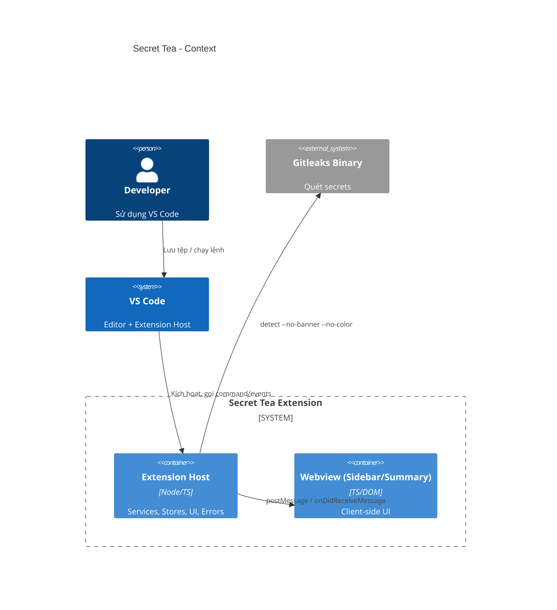
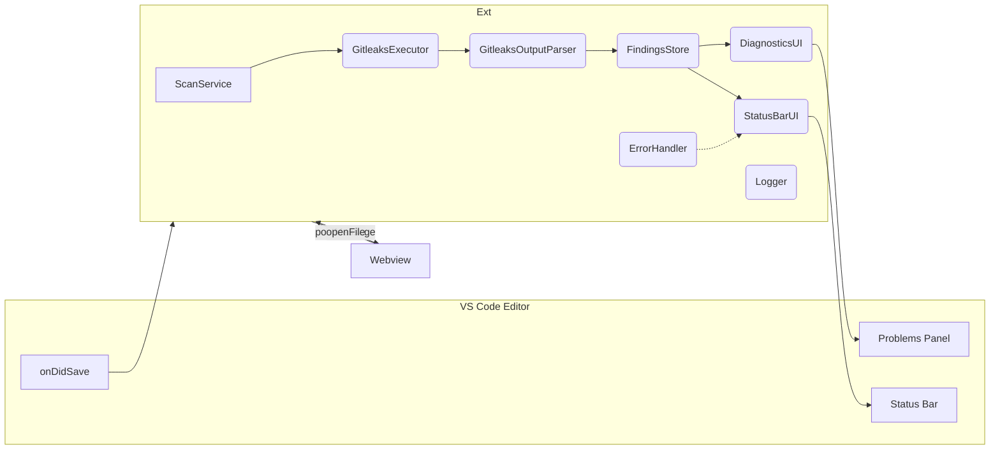
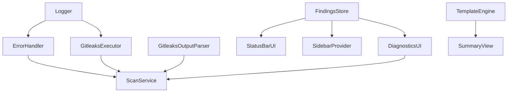
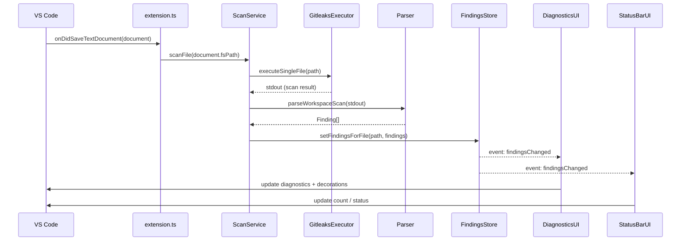
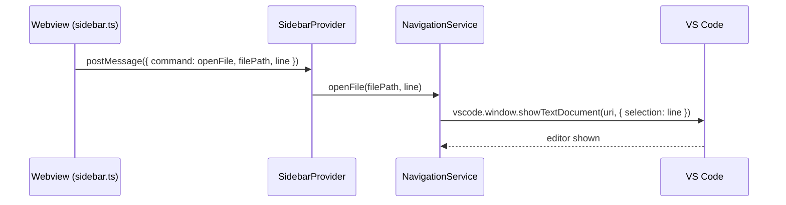
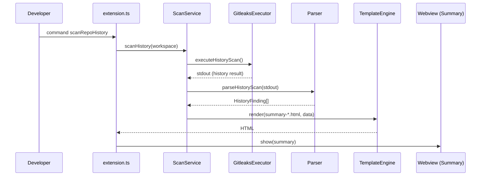
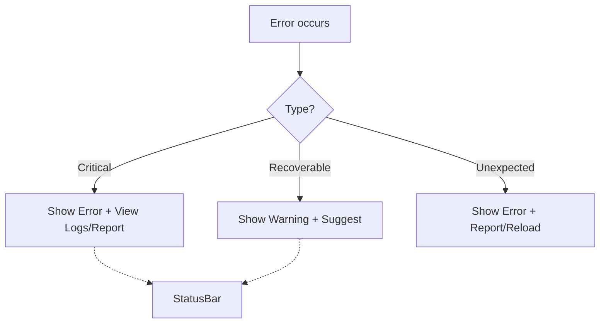

# Secret Tea
---

## 1) Use Case (Trường hợp sử dụng)

- Quét khi lưu tệp (On-Save Scan)
  - Khi người dùng lưu tệp, extension quét duy nhất tệp đó để phát hiện secret. Hiệu năng cải thiện ~10–100x so với quét toàn workspace.
- Quét lịch sử Git theo lệnh
  - Người dùng chạy lệnh "Scan git commit history" để quét lịch sử commit, hiển thị bảng tổng hợp kết quả.
- Xem tổng hợp kết quả (Summary View)
  - Hiển thị summary webview (dựa trên template HTML) cho kết quả quét lịch sử.
- Dẫn hướng từ Sidebar đến vị trí secret
  - Sidebar hiển thị danh sách secret theo từng tệp; nhấp vào một secret sẽ mở tệp tại dòng tương ứng.
- Chẩn đoán & đánh dấu trong editor
  - Tô màu (decorations) và diagnostics tại dòng phát hiện secret, đồng bộ hóa với Problems panel.
- Theo dõi trạng thái trên Status Bar
  - Status Bar hiển thị số lượng findings hiện thời; báo lỗi/ cảnh báo khi có sự cố.
- Xử lý lỗi tập trung + gợi ý hành động
  - Hiển thị thông báo thân thiện, gợi ý “View Logs”, “Retry”, “Report Issue”,…; phân loại lỗi (khôi phục được/không).
- Cấu hình hành vi (kế hoạch và một phần đã có)
  - scanOnSave, scanScope (file/workspace), excludePatterns, maxFileSize, severity,…

Biểu đồ Use Case tổng quan:

```mermaid
flowchart TD
  Dev[Developer] -->|Lưu tệp| OnSave[Quét khi lưu (file)]
  Dev -->|Cmd Palette| ScanWS[Quét Workspace]
  Dev -->|Cmd Palette| ScanHist[Quét Lịch sử Git]
  OnSave --> UpdateDiag[Diagnostics + Decorations]
  ScanWS --> UpdateDiag
  ScanHist --> Summary[Summary Webview]
  Dev --> Sidebar[Sidebar]
  Sidebar -->|Click secret| OpenFile[Open file at line]
  Dev --> StatusBar[Status Bar]
```

---

## 2) Các loại kiến trúc được áp dụng

- Service-based Architecture + Dependency Injection
  - Các dịch vụ core (Executor, Parser, ScanService, Logger, ErrorHandler, TemplateEngine, NavigationService) được khởi tạo và quản lý bởi `ServiceContainer` để tách biệt mối quan tâm và tăng testability.
- Event-driven / Observer
  - `FindingsStore` phát sự kiện khi dữ liệu thay đổi; UI (StatusBar, Sidebar, Diagnostics) subscribe để cập nhật tự động.
- Layered/Modular Separation
  - Phân tầng rõ ràng: Services (business), Stores (state), UI (VS Code UI), Webview (client), Parsers (chuyển đổi dữ liệu), Errors (phân cấp lỗi), Templates (trình bày).
- Command Pattern (VS Code)
  - Lệnh: `project-tea.scanCurrentWorkspace`, `project-tea.scanRepoHistory`, `project-tea.sidebar.refresh`, `project-tea.showOutput`.
- Provider Pattern (WebviewViewProvider)
  - `SidebarProvider` cung cấp webview liên tục trong Activity Bar.
- Template-based Rendering
  - HTML tách khỏi mã TypeScript; render qua `TemplateEngine` và template `.html` để nâng cao maintainability và bảo mật (escape).

Sơ đồ Context/Container (C4-level C1/C2) rút gọn:



---

## 3) Mô tả hệ thống

Secret Tea là một VS Code extension quét secrets (API keys, tokens, passwords) trong workspace và lịch sử Git, tích hợp chặt với Gitleaks. Hệ thống gồm các phần chính:

- Entry & IoC:
  - [src/extension.ts](src/extension.ts) khởi động extension, tạo `ServiceContainer`, đăng ký commands và sự kiện lưu tệp.
  - [src/services/ServiceContainer.ts](src/services/ServiceContainer.ts) khởi tạo và cung cấp các service theo đúng thứ tự phụ thuộc.
- Core Services:
  - [src/services/GitleaksExecutor.ts](src/services/GitleaksExecutor.ts): Gọi binary Gitleaks đa nền tảng; build lệnh và xử lý kết quả, kiểm tra kích thước tệp, phát hiện lỗi Git/binary.
  - [src/services/ScanService.ts](src/services/ScanService.ts): Điều phối toàn bộ luồng quét (file/workspace/history), tương tác với Parser/Store/UI/Logger/ErrorHandler.
  - [src/services/Logger.ts](src/services/Logger.ts): Ghi log có cấu trúc vào Output Channel, hỗ trợ mức độ log.
  - [src/services/ErrorHandler.ts](src/services/ErrorHandler.ts): Trung tâm xử lý lỗi, phân loại và hiện thông báo/ hành động.
  - [src/services/TemplateEngine.ts](src/services/TemplateEngine.ts): Render template HTML, cache template và escape dữ liệu.
  - [src/services/NavigationService.ts](src/services/NavigationService.ts): Mở tệp và di chuyển đến dòng theo nhiều dạng đường dẫn.
- State:
  - [src/stores/FindingsStore.ts](src/stores/FindingsStore.ts): Nguồn dữ liệu trung tâm, event-driven, API thêm/xoá/clear theo tệp hoặc toàn cục.
- UI trong Extension Host:
  - [src/ui/DiagnosticsUI.ts](src/ui/DiagnosticsUI.ts): Diagnostics + Decorations, theo tệp, dispose an toàn.
  - [src/ui/StatusBarUI.ts](src/ui/StatusBarUI.ts): Theo dõi count findings (subscribe store), hiện thông báo lỗi/cảnh báo.
  - [src/ui/SidebarProvider.ts](src/ui/SidebarProvider.ts): Cung cấp webview sidebar, kết nối FindingsStore và NavigationService.
- Webview client-side:
  - [src/webview/sidebar.ts](src/webview/sidebar.ts): Nhận update từ extension, render danh sách file→findings, xử lý tìm kiếm/nhấp để mở tệp (theo thiết kế).
- Parsing & Templates:
  - [src/parsers/GitleaksOutputParser.ts](src/parsers/GitleaksOutputParser.ts): Chuyển stdout của Gitleaks thành `Finding[]`/`HistoryFinding[]` (đã có test).
  - [src/templates/summary-empty.html](src/templates/summary-empty.html), [src/templates/summary-table.html](src/templates/summary-table.html): Template cho summary view.
- Errors:
  - [src/errors/ScanError.ts](src/errors/ScanError.ts), [src/errors/SidebarErrors.ts](src/errors/SidebarErrors.ts): Phân cấp lỗi có `recoverable` + `userMessage`.

Luồng dữ liệu tổng quan:



---

## 4) Công nghệ sử dụng

- Ngôn ngữ & Nền tảng: TypeScript, Node.js
- VS Code Extension API: ^1.104.0 (kích hoạt: onDidSaveTextDocument, onStartupFinished,…)
- Công cụ quét: Gitleaks (binary kèm theo: executables/ cho Linux/macOS)
- Build & Dev: `tsc`, ESLint, pnpm; watch script cho extension & webview
- Test: Jest + ts-jest, VS Code API mocks, coverage
- Giao diện Webview: TypeScript client, CSS (Codicons), HTML templates

Tham khảo cấu hình: [package.json](package.json), [tsconfig.json](tsconfig.json), [eslint.config.mjs](eslint.config.mjs).

---

## 5) Design Patterns áp dụng

- Dependency Injection: `ServiceContainer` dựng và cung cấp services theo hợp đồng `interfaces.ts`.
- Observer / Publish–Subscribe: `FindingsStore` phát sự kiện; `StatusBarUI`/`SidebarProvider`/`DiagnosticsUI` subscribe.
- Command Pattern: Đăng ký commands theo chuẩn VS Code; mỗi command gọi service tương ứng.
- Provider Pattern (WebviewViewProvider): `SidebarProvider` quản trị vòng đời webview trong Activity Bar.
- Strategy-ish (điều hướng/tối ưu): `NavigationService` xử lý các biến thể path; `GitleaksExecutor` xây dựng lệnh tương ứng chế độ file/workspace/history.
- Template Method/Simple Templating: `TemplateEngine` render HTML từ templates và dữ liệu.
- Error Hierarchy: `ScanError` + lớp con để phân loại và gợi ý hành động; `ErrorHandler` tập trung hóa logic ứng xử.
- Single Responsibility & Separation of Concerns: Mỗi service/module có nhiệm vụ rõ ràng; giảm “god object”.

Sơ đồ phụ thuộc dịch vụ (trừu tượng):



---

## 6) Thiết kế hệ thống (chi tiết + biểu đồ)

### 6.1 Kiến trúc thành phần (Component Diagram)

```mermaid
flowchart LR
  subgraph ExtensionHost[Extension Host]
    ExtTS[extension.ts]
    Container[ServiceContainer]
    subgraph Services
      Exec[GitleaksExecutor]
      Scan[ScanService]
      Parse[GitleaksOutputParser]
      Store[FindingsStore]
      Diag[DiagnosticsUI]
      Stat[StatusBarUI]
      Nav[NavigationService]
      Tpl[TemplateEngine]
      Err[ErrorHandler]
      Log[Logger]
    end
    subgraph UI_Ext[UI (extension)]
      Problems[Diagnostics]
      StatusBar
      SidebarProv[SidebarProvider]
    end
  end

  subgraph Webview
    SidebarTS[sidebar.ts]
  end

  ExtTS --> Container --> Services
  Scan --> Exec --> Parse --> Store
  Store --> Diag --> Problems
  Store --> Stat --> StatusBar
  SidebarProv <-->|postMessage| SidebarTS
  SidebarTS -->|openFile| Nav
```

### 6.2 Trình tự quét khi lưu tệp (Sequence Diagram)



### 6.3 Trình tự mở file từ Sidebar



### 6.4 Trình tự quét lịch sử Git



### 6.5 Deployment Diagram (môi trường chạy)

```mermaid
flowchart TB
  subgraph UserOS[User OS (Linux/macOS/Windows)]
    VS[VS Code]
    subgraph VS[VS Code]
      EH[Extension Host (Node/TS)]
      WV[Webview (Chromium sandbox)]
    end
    GL[Gitleaks Binary]
  end

  EH -->|exec detect| GL
  EH --> WV
```

### 6.6 Mô hình lỗi & xử lý lỗi

- Phân cấp lỗi: `ExecutableNotFoundError`, `GitRepositoryError`, `FileTooLargeError`, `ExecutionError`, `ParseError`, `FileSystemError`, `InvalidStateError`…
- `ErrorHandler` phân loại và đưa ra hành động: hiển thị thông báo thân thiện, nút “View Logs/Retry/Report Issue/Initialize Git/Scan Workspace Instead”, cập nhật Status Bar.



---

## 7) Lộ trình triển khai & chất lượng (tóm tắt)

- Phase 1: Cải thiện hiệu năng quét khi lưu, thiết lập test (đã hoàn tất). Xem [PHASE1_IMPLEMENTATION.md](memory-bank/PHASE1_IMPLEMENTATION.md).
- Phase 2: Kiến trúc dịch vụ + store + DI, loại bỏ state toàn cục (đã hoàn tất). Xem [PHASE2_IMPLEMENTATION.md](memory-bank/PHASE2_IMPLEMENTATION.md).
- Phase 3: Xử lý lỗi tập trung, phân cấp lỗi (đã hoàn tất). Xem [PHASE3_IMPLEMENTATION.md](memory-bank/PHASE3_IMPLEMENTATION.md).
- Các hạng mục tiếp: cấu hình người dùng, tăng coverage >80%, logging nâng cao, caching, polish webview. Chi tiết trong [REFACTORING_PLAN.md](memory-bank/REFACTORING_PLAN.md) và [DESIGN.md](memory-bank/DESIGN.md).

---

## 8) Ma trận ánh xạ artefact → mã nguồn

- Entry/IoC: [src/extension.ts](src/extension.ts), [src/services/ServiceContainer.ts](src/services/ServiceContainer.ts)
- Services: [src/services/GitleaksExecutor.ts](src/services/GitleaksExecutor.ts), [src/services/ScanService.ts](src/services/ScanService.ts), [src/services/Logger.ts](src/services/Logger.ts), [src/services/ErrorHandler.ts](src/services/ErrorHandler.ts), [src/services/NavigationService.ts](src/services/NavigationService.ts), [src/services/TemplateEngine.ts](src/services/TemplateEngine.ts), [src/services/interfaces.ts](src/services/interfaces.ts)
- Store: [src/stores/FindingsStore.ts](src/stores/FindingsStore.ts)
- UI: [src/ui/DiagnosticsUI.ts](src/ui/DiagnosticsUI.ts), [src/ui/StatusBarUI.ts](src/ui/StatusBarUI.ts), [src/ui/SidebarProvider.ts](src/ui/SidebarProvider.ts)
- Webview: [src/webview/sidebar.ts](src/webview/sidebar.ts), [media/*](media)
- Parser: [src/parsers/GitleaksOutputParser.ts](src/parsers/GitleaksOutputParser.ts)
- Errors: [src/errors/ScanError.ts](src/errors/ScanError.ts), [src/errors/SidebarErrors.ts](src/errors/SidebarErrors.ts)
- Templates: [src/templates/summary-empty.html](src/templates/summary-empty.html), [src/templates/summary-table.html](src/templates/summary-table.html)

---

## 9) Bảo mật, hiệu năng, khả năng bảo trì

- Bảo mật
  - Escape HTML trong summary; hạn chế XSS trong webview.
  - Không log nội dung secret thô ra Output Channel (khuyến nghị).
- Hiệu năng
  - Quét khi lưu chỉ trên tệp thay đổi; debounce và queue (đề xuất) để tránh race.
  - Trang trí/diagnostics incremental; dispose decorations theo tệp.
- Bảo trì
  - DI + interfaces giúp test/mocking dễ dàng; tách trách nhiệm rõ ràng.
  - Templates tách khỏi code, dễ chỉnh sửa UI.

---

## 10) Phụ lục: Sơ lược quyết định & tiến trình

- Decision Log: memory-bank/decisionLog.md – chọn DI, FindingsStore, Observer, template extraction, Jest,…
- Active Context: memory-bank/activeContext.md – trọng tâm hiện tại, vấn đề còn mở.
- Sidebar Feature Summary: memory-bank/SIDEBAR_FEATURE_SUMMARY.md – phân tích sâu Sidebar.
- Progress: memory-bank/progress.md – tiến độ, các mốc hoàn thành.

---

Nếu cần thêm biểu đồ chuyên sâu (ví dụ C4 chi tiết từng container/component, hoặc sequence cho error-handling), vui lòng yêu cầu; template/report có thể mở rộng dễ dàng.
